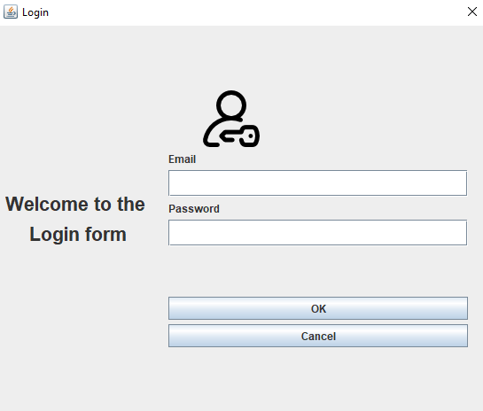

# :closed_lock_with_key: Registration and Login form

## Create an authentication with Java

## Illustration 

## Languages/Tools
- Java
- MySQL
- GUI Form
- mysql-connector-java

## Goals
- Improve Java development
- Improve authentication mechanisms

## How to use 
In RegistrationForm class or LoginForm class
=> right click
=> run method.main()

## Status
Project completed

## Context
Project developed as a junior web developer during my BTS SIO SLAM. 